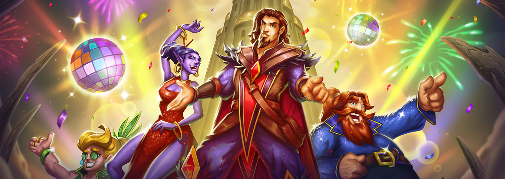
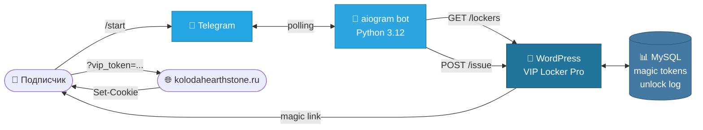

<div align="center">



# 🃏 Колода Hearthstone — VIP Locker

**Платная подписка на премиум-контент через Telegram.**
Одноразовые magic-link, проверка подписки на канал, элегантный UI с премиум-эмодзи.

[](https://www.python.org)
[](https://docs.aiogram.dev)
[](https://wordpress.org)
[](https://php.net)
[](https://docs.docker.com/compose/)
[](https://core.telegram.org/bots/api)

[О проекте](#-о-проекте) · [Фичи](#-возможности) · [Архитектура](#-архитектура) · [Установка](#-быстрый-старт) · [Конфигурация](#-конфигурация)

</div>

---

## ✨ О проекте

Связка из **WordPress-плагина** и **Telegram-бота** для монетизации эксклюзивного контента сайта [kolodahearthstone.ru](https://kolodahearthstone.ru). Подписчик платит через Boosty или Telegram Stars, подписывается на канал — и получает в Telegram-боте одноразовую ссылку, которая разблокирует VIP-статью в браузере на 7 дней.

> **Зачем не просто PayWall?** Потому что 90% оплат в RU-сегменте идут через Telegram-сообщества. Бот живёт в той же среде, что и аудитория, проверяет подписку и стирает все границы между «оплатил» и «получил доступ».

## 🚀 Возможности

<table>
<tr>
<td width="50%" valign="top">

### 🔐 Безопасные magic-link
- Одноразовые токены 32 символа (16 байт энтропии)
- Срок жизни 15 минут (настраивается)
- Cookie действует 7 дней после первой активации
- Honeypot, лог попыток, защита от sharing

</td>
<td width="50%" valign="top">

### 🤖 Premium Telegram UI
- Bot API 9.4 — кастомные эмодзи в **кнопках** и тексте
- Единый стиль анимированного NewsEmoji пака
- Premium-эмодзи рендерятся через `<tg-emoji>` и `icon_custom_emoji_id`
- Все 39+ VIP-статей с обложками в каталоге

</td>
</tr>
<tr>
<td width="50%" valign="top">

### 📦 Контроль подписки
- Авто-проверка членства в канале **и** группе
- Кэш статусов 60с — без спама `getChatMember`
- Поддержка Boosty (карты, СБП) и Tribute (Telegram Stars)

</td>
<td width="50%" valign="top">

### 🔍 SEO-дружелюбность
- Контент под замком кодируется (Base64+ROT13) — не индексируется
- Публичный тизер виден краулерам
- `schema.org/Article` помечен `isAccessibleForFree: false`
- Совместимость с Yoast SEO, Rank Math

</td>
</tr>
<tr>
<td width="50%" valign="top">

### 🌍 Geo-таргетинг без хранения IP
- Cloudflare `CF-IPCountry` → 0 запросов
- Fallback `ip-api.com` с кэшем 24ч
- Никаких персональных данных в БД

</td>
<td width="50%" valign="top">

### ⚡ Производительность
- Bot подгружает обложки с WP сам — обходит Wordfence хотлинк
- `file_id` кэш на диске, прогрев при старте
- Shared `httpx.AsyncClient` с keep-alive (TLS handshake один раз)
- Periodic refresh каталога каждые 30 мин

</td>
</tr>
</table>

## 🏗 Архитектура



### Поток разблокировки

1. **Юзер** жмёт `/start` → бот проверяет подписку через `getChatMember` для канала и группы.
2. **Не подписан** → экран с Boosty/Tribute и кнопкой «Я подписался — проверить».
3. **Подписан** → каталог VIP-статей с обложками, навигация ◀️ ▶️.
4. **Жмёт «Получить доступ»** → бот делает `POST /wp-json/vip/v1/issue` с bearer-токеном.
5. **WP-плагин** генерирует токен на 15 минут, сохраняет в `wp_options`, возвращает URL.
6. **Юзер открывает ссылку** в системном браузере → cookie на 7 дней → токен сжигается.

## 🚦 Быстрый старт

### 1. WordPress-плагин

Скопируй файлы `simple-vip-locker.php`, `svl-*.php`, `svl-*.js` в `wp-content/plugins/vip-locker/` и активируй в админке.

```bash
cd wp-content/plugins
git clone https://github.com/Zulut30/kolodaheartstone-auth.git vip-locker
# Активировать в Plugins → VIP Locker Pro
```

В админке → **VIP Locker → Telegram бот**:
- Сгенерировать **Bearer-секрет** (он же `WP_BEARER` для бота)
- Выставить TTL токенов (по умолчанию 900с)

Использование в редакторе:
```
[vip_locker code="VIP_GUIDE_2026"]
Премиум-контент здесь...
[/vip_locker]
```

### 2. Telegram-бот

```bash
git clone https://github.com/Zulut30/kolodaheartstone-auth.git
cd kolodaheartstone-auth
cp bot/.env.example bot/.env
# заполни BOT_TOKEN, CHANNEL_ID, GROUP_ID, WP_BEARER...

docker compose up -d --build bot
docker compose logs -f bot
```

После старта в [@BotFather](https://t.me/BotFather) добавь команды:
- `start` — Главное меню
- `catalog` — Каталог VIP-статей
- `subscribe` — Оформить подписку
- `help` — Помощь

## 🔧 Конфигурация

Файл `bot/.env`:

| Переменная | Тип | Описание |
|---|---|---|
| `BOT_TOKEN` | str | Токен бота от @BotFather |
| `WP_BASE_URL` | url | `https://kolodahearthstone.ru` |
| `WP_BEARER` | str | Bearer-секрет из настроек плагина |
| `CHANNEL_ID` | int | ID канала (с `-100...`) |
| `GROUP_ID` | int | ID группы (с `-100...`) |
| `BOOSTY_URL` | url | Ссылка на Boosty-подписку *(опц.)* |
| `TRIBUTE_URL` | url | Ссылка на Tribute *(опц.)* |
| `DATA_DIR` | path | Куда писать `photo_cache.json` |
| `REFRESH_INTERVAL_SEC` | int | Период refresh каталога *(дефолт 1800)* |
| `HTTP_TIMEOUT` | float | Таймаут запросов к WP *(дефолт 10)* |

## 📂 Структура

```
kolodaheartstone-auth/
├── bot/                      🤖 Telegram-бот (Python 3.12 / aiogram 3.13)
│   ├── bot.py                Основной модуль — 900+ строк
│   ├── Dockerfile            python:3.12-slim
│   ├── requirements.txt      aiogram + httpx
│   └── banner.jpg            Бренд-баннер для welcome-экрана
├── simple-vip-locker.php     🔌 Главный файл WP-плагина
├── svl-magic.php             ⚡ Magic-link токены + redeem
├── svl-bot.php               🌉 REST API мост к боту
├── svl-pro.php               💎 Pro: темы, honeypot, sitemap
├── svl-seo.php               🔍 SEO: encrypted content + schema.org
├── svl-geo.php               🌍 Cloudflare CF-IPCountry
├── svl-block.php             🧩 Gutenberg-блок
├── svl-tinymce.js            ✏️  Classic Editor кнопка
├── docker-compose.yml        🐳 Развёртывание
├── banner.jpg                🎨 Hero-изображение
└── README.md                 📖 Этот файл
```

## 🧰 Tech Stack

<div align="center">

| Слой | Технологии |
|:---:|:---:|
| **Bot** | Python 3.12 · aiogram 3.13 · httpx · Docker |
| **WP** | PHP 7.4+ · WordPress 6.x · MySQL · REST API |
| **API** | Telegram Bot API 9.4 · REST + Bearer · JSON |
| **Frontend** | Vanilla JS · Gutenberg блоки · TinyMCE |
| **Infra** | Docker Compose · Cloudflare · Wordfence |

</div>

## 🎨 Premium Telegram UI

Бот использует **Bot API 9.4** (Feb 2026) для рендера кастомных эмодзи прямо в инлайн-кнопках:

```python
InlineKeyboardButton(
    text="Каталог статей",
    callback_data="catalog:0",
    icon_custom_emoji_id="5222444124698853913",  # animated bookmark
)
```

В тексте сообщений — через HTML-тег:

```html
<tg-emoji emoji-id="5424972470023104089">🔥</tg-emoji> Последняя статья
```

Все ID из публичного каталога [Zulut30/premium-telegram-emoji](https://github.com/Zulut30/premium-telegram-emoji) — единый анимированный NewsEmoji пак для визуальной согласованности.

> **Требование:** владелец бота должен иметь активную подписку Telegram Premium, иначе кастомные эмодзи не отображаются у получателей.

## 📜 Лицензия

Внутренний проект kolodahearthstone.ru. Все права защищены.

---

<div align="center">

**Made with ❤️ for the Russian Hearthstone community**

[kolodahearthstone.ru](https://kolodahearthstone.ru) · [@kolodahearthstoneauthbot](https://t.me/kolodahearthstoneauthbot) · [Boosty](https://boosty.to/kolodahearthstone)

</div>
